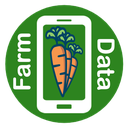

<h1 align="center">Open Source Contributions</h1>

The projects I've contributed to, with a link to every merged pull request.

 

<h2 align="center">Mermaid.js</h2>

<table>
  <tr>
    <td width="80" align="center" valign="top"> </td>
    <td valign="top">
       
      

        
        
        
      

      
Mermaid.js turns a few lines of text into diagrams. GitHub and Microsoft both use it, so every change has to pass CI and a maintainer's review before it's merged. Three of mine made it in, across 76 commits.

      <ul>
        <li>
<a href="https://github.com/mermaid-js/mermaid/pull/6475">Data labels that fit inside the bars of XY charts</a> They resize and reposition themselves instead of overflowing, in both orientations.
</li>
        <li>
<a href="https://github.com/mermaid-js/mermaid/pull/6274">Word wrapping for journey diagram legends</a> Long labels used to run into the diagram. Now they wrap at a maximum width.
</li>
        <li><a href="https://github.com/mermaid-js/mermaid/pull/6225">Title color, font, and size options for journey diagrams</a> Set through the YAML config at the top of the diagram. &nbsp;</li>
      </ul>
    </td>
  </tr>
</table>

<a href="https://github.com/mermaid-js/mermaid/pulls?q=is%3Apr+involves%3AShahir-47+is%3Amerged">Every pull request I've opened on Mermaid.js</a>

Contributor graph screenshot

 

The <a href="https://github.com/mermaid-js/mermaid/graphs/contributors">live graph</a> takes a few seconds to load, and you may need to scroll or search the page for Shahir-47.

 

<h2 align="center">FarmData2</h2>

<table>
  <tr>
    <td width="80" align="center" valign="top"> </td>
    <td valign="top">
       
      

        
        
        
      

      
FarmData2 is open source record keeping that vegetable farms use for organic certification, funded by the National Science Foundation. I worked on it for a year as an intern and ended up as its 2nd top contributor, with 28 commits and 14,000+ lines added.

      <ul>
        <li>
Built the transactional REST APIs, on Node.js and PostgreSQL, that log crops automatically
</li>
        <li>
Moved the form components to Vuex, which cut how long pages took to load
</li>
        <li>Added end to end tests in Cypress so the forms keep working as the project grows &nbsp;</li>
      </ul>
    </td>
  </tr>
</table>

<a href="https://github.com/FarmData2/FarmData2/pulls?q=is%3Apr+involves%3AShahir-47+is%3Amerged">Every pull request I've opened on FarmData2</a>

Contributor graph screenshot

 

The <a href="https://github.com/FarmData2/FarmData2/graphs/contributors">live graph</a> takes a few seconds to load, and you may need to scroll or search the page for Shahir-47.

 

<h2 align="center">Contact</h2>

  
  
  
  

<i>Thanks for checking out my open source work!</i>

